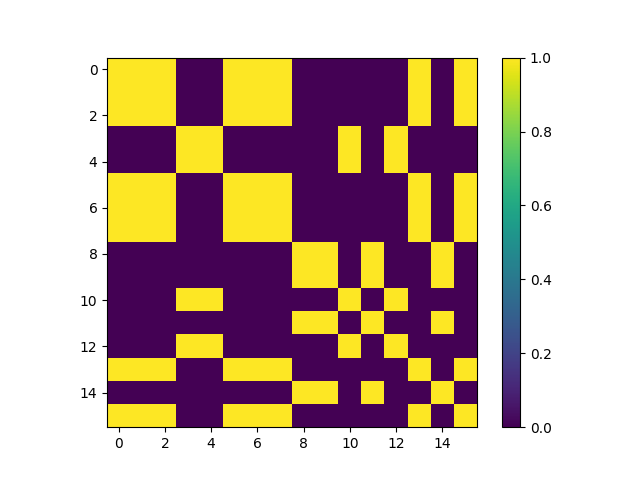
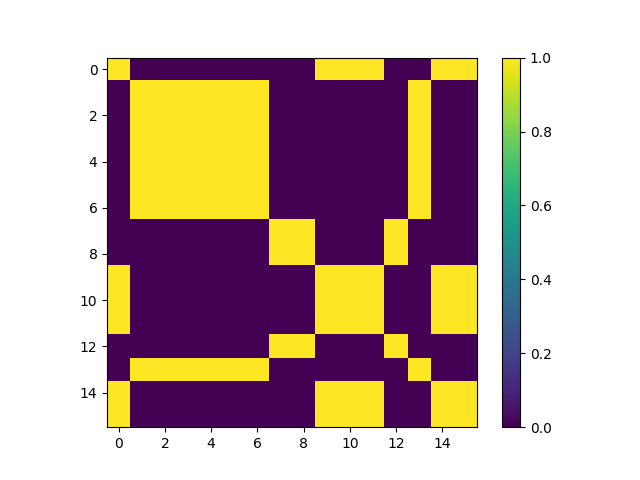

# Multi-class N-pair Loss

npair loss 관련 공부자료 : Improved Deep Metric Learning with Multi-class N-pair Loss Objective

## Examples

## 참고자료

* https://github.com/ChaofWang/Npair_loss_pytorch
* https://github.com/tensorflow/tensorflow/blob/r1.10/tensorflow/contrib/losses/python/metric_learning/metric_loss_ops.py
